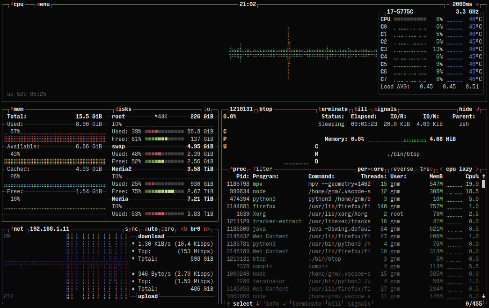
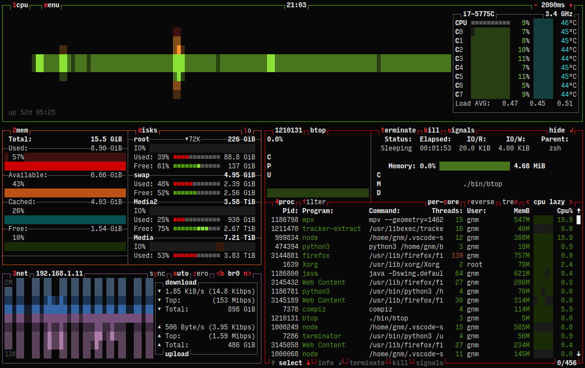
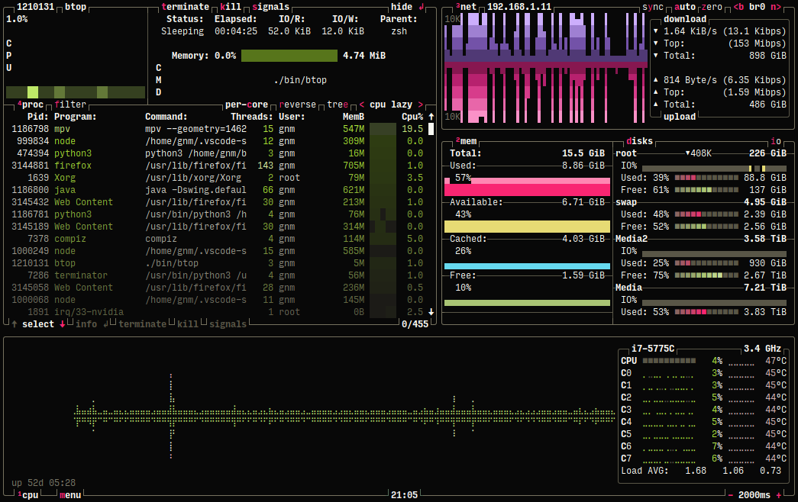
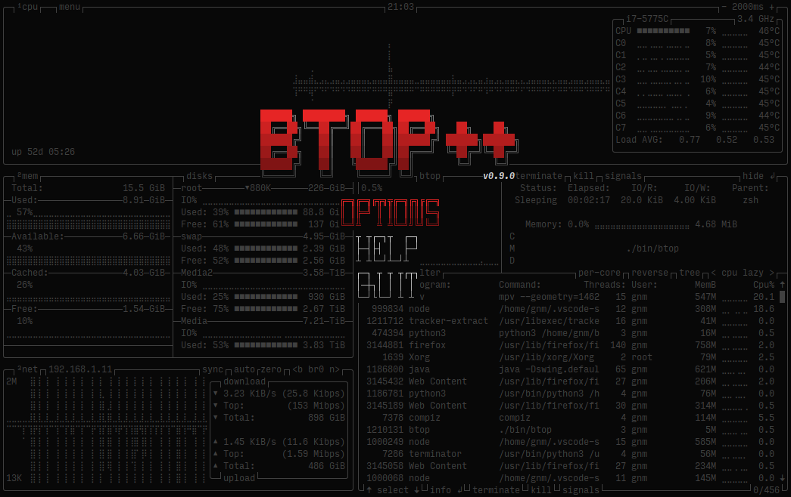
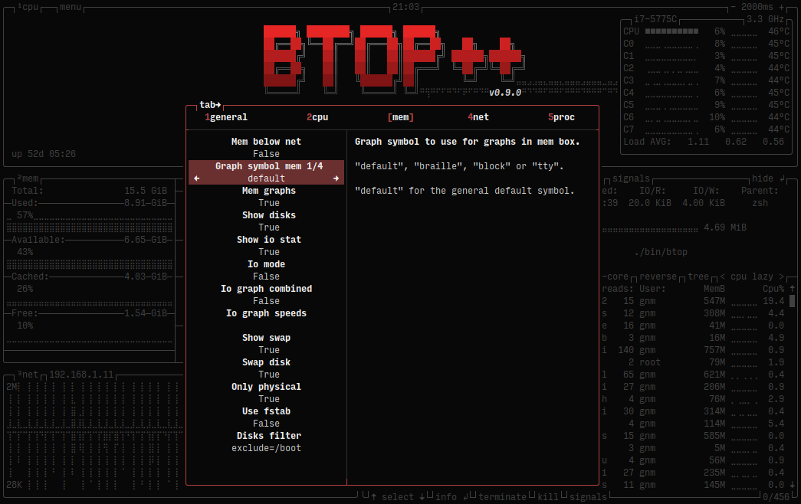
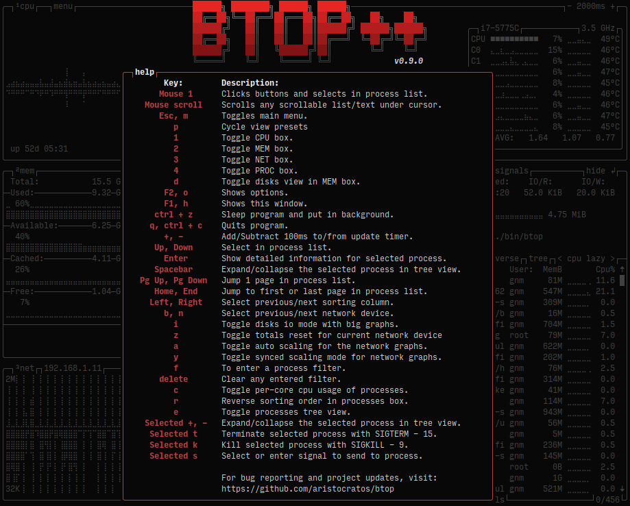

# 

<a href="https://repology.org/project/btop/versions">
    
</a>


[](https://paypal.me/aristocratos)
[](https://github.com/sponsors/aristocratos)
[](https://ko-fi.com/aristocratos)
[](https://snapcraft.io/btop)
[](https://github.com/aristocratos/btop/actions/workflows/continuous-build-linux.yml)
[](https://github.com/aristocratos/btop/actions/workflows/continuous-build-macos.yml)
[](https://github.com/aristocratos/btop/actions/workflows/continuous-build-freebsd.yml)
[](https://github.com/aristocratos/btop/actions/workflows/continuous-build-openbsd.yml)

## Index

* [News](#news)
* [Documents](#documents)
* [Description](#description)
* [Features](#features)
* [Themes](#themes)
* [Support and funding](#support-and-funding)
* [Prerequisites](#prerequisites) (Read this if you are having issues!)
* [Screenshots](#screenshots)
* [Keybindings](#help-menu)
* [Installation Linux/macOS](#installation)
* [Compilation Linux](#compilation-linux)
* [Compilation macOS](#compilation-macos-osx)
* [Compilation FreeBSD](#compilation-freebsd)
* [Compilation OpenBSD](#compilation-openbsd)
* [GPU compatibility](#gpu-compatibility)
* [Installing the snap](#installing-the-snap)
* [Configurability](#configurability)
* [License](#license)

## News

##### 7 January 2024

Btop release v1.3.0

Big release with GPU support added for Linux and platform support for OpenBSD. Big thanks to @romner-set (GPU support) and @joske (OpenBSD support) for contributions.
And a multitude of bugfixes and small changes, see [CHANGES.md](CHANGES.md) and latest [release](https://github.com/aristocratos/btop/releases/latest) for detailed list and attributions.

See news entry below for more information regarding GPU support.

##### 25 November 2023

GPU monitoring added for Linux!

Compile from git main to try it out.

Use keys `5`, `6`, `7` and `0` to show/hide the gpu monitoring boxes. `5` = Gpu 1, `6` = Gpu 2, etc.

Gpu stats/graphs can also be displayed in the "Cpu box" (not as verbose), see the cpu options menu for info and configuration.

Note that the binaries provided on the release page (when released) and the continuous builds will not have gpu support enabled.

Because the GPU support relies on loading of dynamic gpu libraries, gpu support will not work when also static linking.

See [Compilation Linux](#compilation-linux) for more info on how to compile with gpu monitoring support.

Many thanks to [@romner-set](https://github.com/romner-set) who wrote the vast majority of the implementation for GPU support.

Big update with version bump to 1.3 coming soon.

##### 28 August 2022

[](https://github.com/aristocratos/btop4win)

First release of btop4win available at https://github.com/aristocratos/btop4win

<details>
<summary>More...</summary>

##### 16 January 2022

Release v1.2.0 with FreeBSD support. No release binaries for FreeBSD provided as of yet.

Again a big thanks to [@joske](https://github.com/joske) for his porting efforts!

Since compatibility with Linux, macOS and FreeBSD are done, the focus going forward will be on new features like GPU monitoring.

##### 13 November 2021

Release v1.1.0 with macOS support. Binaries in [continuous-build-macos](https://github.com/aristocratos/btop/actions/workflows/continuous-build-macos.yml) are only x86 for now.
macOS binaries + installer are included for both x86 and ARM64 (Apple Silicon) in the releases.

Big thank you to [@joske](https://github.com/joske) who wrote the vast majority of the implementation!

##### 30 October 2021

Work on the OSX [macOS] and FreeBSD branches, both initiated and mostly worked on by [@joske](https://github.com/joske), will likely be completed in the coming weeks.
The OSX [macOS] branch has some memory leaks that needs to be sorted out and both have some issues with the processes cpu usage calculation and other smaller issues that needs fixing.

If you want to help out, test for bugs/fix bugs or just try out the branches:

**macOS / OSX**
```bash
# Install and use Homebrew or MacPorts package managers for easy dependency installation
brew install coreutils make gcc@11
git clone https://github.com/aristocratos/btop.git
cd btop
git checkout OSX
gmake
```

**FreeBSD**
```bash
sudo pkg install gmake gcc11 coreutils git
git clone https://github.com/aristocratos/btop.git
cd btop
git checkout freebsd
gmake
```

Note that GNU make (`gmake`) is recommended but not required for macOS/OSX but it is required on FreeBSD.


##### 6 October 2021

macOS development have been started by [@joske](https://github.com/joske), big thanks :)
See branch [OSX](https://github.com/aristocratos/btop/tree/OSX) for current progress.

##### 18 September 2021

The Linux version of btop++ is complete. Released as version 1.0.0

I will be providing statically compiled binaries for a range of architectures in every release for those having problems compiling.

For compilation GCC 10 is required, GCC 11 preferred.

Please report any bugs to the [Issues](https://github.com/aristocratos/btop/issues/new?assignees=aristocratos&labels=bug&template=bug_report.md&title=%5BBUG%5D) page.

The development plan right now:

* 1.1.0 macOS [OSX] support
* 1.2.0 FreeBSD support
* 1.3.0 Support for GPU monitoring
* 1.X.0 Other platforms and features...

Windows support is not in the plans as of now, but if anyone else wants to take it on, I will try to help.

##### 5 May 2021

This project is gonna take some time until it has complete feature parity with bpytop, since all system information gathering will have to be written from scratch without any external libraries.
And will need some help in the form of code contributions to get complete support for BSD and macOS/OSX.

</details>

## Documents

**[CHANGELOG.md](CHANGELOG.md)**

**[CONTRIBUTING.md](CONTRIBUTING.md)**

**[CODE_OF_CONDUCT.md](CODE_OF_CONDUCT.md)**

## Description

Resource monitor that shows usage and stats for processor, memory, disks, network and processes.

C++ version and continuation of [bashtop](https://github.com/aristocratos/bashtop) and [bpytop](https://github.com/aristocratos/bpytop).

## Features

* Easy to use, with a game inspired menu system.
* Full mouse support, all buttons with a highlighted key is clickable and mouse scroll works in process list and menu boxes.
* Fast and responsive UI with UP, DOWN keys process selection.
* Function for showing detailed stats for selected process.
* Ability to filter processes.
* Easy switching between sorting options.
* Tree view of processes.
* Send any signal to selected process.
* UI menu for changing all config file options.
* Auto scaling graph for network usage.
* Shows IO activity and speeds for disks.
* Battery meter
* Selectable symbols for the graphs.
* Custom presets
* And more...

## Themes

Btop++ uses the same theme files as bpytop and bashtop (some color values missing in bashtop themes) .

See [themes](https://github.com/aristocratos/btop/tree/main/themes) folder for available themes.

The `make install` command places the default themes in `[$PREFIX or /usr/local]/share/btop/themes`.
User created themes should be placed in `$XDG_CONFIG_HOME/btop/themes` or `$HOME/.config/btop/themes`.

Let me know if you want to contribute with new themes.

## Support and funding

You can sponsor this project through github, see [my sponsors page](https://github.com/sponsors/aristocratos) for options.

Or donate through [paypal](https://paypal.me/aristocratos) or [ko-fi](https://ko-fi.com/aristocratos).

Any support is greatly appreciated!

## Prerequisites

For best experience, a terminal with support for:

* 24-bit truecolor ([See list of terminals with truecolor support](https://github.com//termstandard/colors))
* 256-color terminals are supported through 24-bit to 256-color conversion when setting "truecolor" to False in the options or with "-lc/--low-color" arguments.
* 16 color TTY mode will be activated if a real tty device is detected. Can be forced with "-t/--tty_on" arguments.
* Wide characters (Are sometimes problematic in web-based terminals)

Also needs a UTF8 locale and a font that covers:

* Unicode Block “Braille Patterns” U+2800 - U+28FF (Not needed in TTY mode or with graphs set to type: block or tty.)
* Unicode Block “Geometric Shapes” U+25A0 - U+25FF
* Unicode Block "Box Drawing" and "Block Elements" U+2500 - U+259F

### **Notice (Text rendering issues)**

* If you are having problems with the characters in the graphs not looking like they do in the screenshots, it's likely a problem with your systems configured fallback font not having support for braille characters.

* See [Terminess Powerline](https://github.com/ryanoasis/nerd-fonts/tree/master/patched-fonts/Terminus/terminus-ttf-4.40.1) for an example of a font that includes the braille symbols.

* See comments by @sgleizes [link](https://github.com/aristocratos/bpytop/issues/100#issuecomment-684036827) and @XenHat [link](https://github.com/aristocratos/bpytop/issues/100#issuecomment-691585587) in issue #100 for possible solutions.

* If text are misaligned and you are using Konsole or Yakuake, turning off "Bi-Directional text rendering" is a possible fix.

* Characters clipping in to each other or text/border misalignments is not bugs caused by btop, but most likely a fontconfig or terminal problem where the braille characters making up the graphs aren't rendered correctly.

* Look to the creators of the terminal emulator you use to fix these issues if the previous mentioned fixes don't work for you.

## Screenshots

#### Main UI showing details for a selected process



#### Main UI in TTY mode



#### Main UI with custom options



#### Main-menu



#### Options-menu



#### Help-menu



## Installation

**Binaries for Linux are statically compiled with musl and works on kernel 2.6.39 and newer**

1. **Download btop-(VERSION)-(ARCH)-(PLATFORM).tbz from [latest release](https://github.com/aristocratos/btop/releases/latest) and unpack to a new folder**

   **Notice! Use x86_64 for 64-bit x86 systems, i486 and i686 are 32-bit!**

2. **Install (from created folder)**

   * **Run install.sh or:**

   ```bash
   # use "make install PREFIX=/target/dir" to set target, default: /usr/local
   # only use "sudo" when installing to a NON user owned directory
   sudo make install
   ```

3. **(Optional) Set suid bit to make btop always run as root (or other user)**

   Enables signal sending to any process without starting with `sudo` and can prevent /proc read permissions problems on some systems.

   * **Run setuid.sh or:**

   ```bash
   # run after make install and use same PREFIX if any was used at install
   # set SU_USER and SU_GROUP to select user and group, default is root:root
   sudo make setuid
   ```

* **Uninstall**

  * **Run uninstall.sh or:**

   ```bash
   sudo make uninstall
   ```

* **Show help**

   ```bash
   make help
   ```

**Binary release (from native os repo)**

* **openSUSE**
  * **Tumbleweed:**
    ```bash
    sudo zypper in btop
    ```
  * For all other versions, see [openSUSE Software: btop](https://software.opensuse.org/package/btop)
* **Fedora**
    ```bash
    sudo dnf install btop
	```
* **RHEL/AlmaLinux 8+**
    ```bash
    sudo dnf install epel-release
	sudo dnf install btop
	```
* **FreeBSD**
	```sh
	pkg install btop
	```


**Binary release on Homebrew (macOS (x86_64 & ARM64) / Linux (x86_64))**

* **[Homebrew](https://formulae.brew.sh/formula/btop)**
  ```bash
  brew install btop
  ```

## Compilation Linux

   Requires at least GCC 10 or Clang 16.

   The makefile also needs GNU coreutils and `sed` (should already be installed on any modern distribution).

   ### GPU compatibility

   Btop++ supports NVIDIA and AMD GPUs out of the box on Linux x86_64, provided you have the correct drivers and libraries.

   Compatibility with Intel GPUs using generic DRM calls is planned, as is compatibility for FreeBSD and macOS.

   Gpu support will not work when static linking glibc (or musl, etc.)!

   For x86_64 Linux the flag `GPU_SUPPORT` is automatically set to `true`, to manually disable gpu support set the flag to false, like:

   `make GPU_SUPPORT=false` (or `cmake -DBTOP_GPU=false` with CMake)

 * **NVIDIA**

    You must use an official NVIDIA driver, both the closed-source and [open-source](https://github.com/NVIDIA/open-gpu-kernel-modules) ones have been verified to work.

    In addition to that you must also have the `nvidia-ml` dynamic library installed, which should be included with the driver package of your distribution.

 * **AMD**

    AMDGPU data is queried using the [ROCm SMI](https://github.com/RadeonOpenCompute/rocm_smi_lib) library, which may or may not be packaged for your distribution. If your distribution doesn't provide a package, btop++ is statically linked to ROCm SMI with the `RSMI_STATIC=true` make flag.

    This flag expects the ROCm SMI source code in `lib/rocm_smi_lib`, and compilation will fail if it's not there. The latest tested version is 5.6.x, which can be obtained with the following command:

   ```bash
   git clone https://github.com/RadeonOpenCompute/rocm_smi_lib.git --depth 1 -b rocm-5.6.x lib/rocm_smi_lib
   ```

<details>
<summary>

### With Make
</summary>

1. **Install dependencies (example for Ubuntu 21.04 Hirsute)**

   ```bash
   sudo apt install coreutils sed git build-essential gcc-11 g++-11
   ```

2. **Clone repository**

   ```bash
   git clone https://github.com/aristocratos/btop.git
   cd btop
   ```

3. **Compile**

   ```bash
   make
   ```

   Options for make:

   | Flag                            | Description                                                             |
   |---------------------------------|-------------------------------------------------------------------------|
   | `VERBOSE=true`                  | To display full compiler/linker commands                                |
   | `STATIC=true`                   | For static compilation                                                  |
   | `QUIET=true`                    | For less verbose output                                                 |
   | `STRIP=true`                    | To force stripping of debug symbols (adds `-s` linker flag)             |
   | `DEBUG=true`                    | Sets OPTFLAGS to `-O0 -g` and enables more verbose debug logging        |
   | `ARCH=<architecture>`           | To manually set the target architecture                                 |
   | `GPU_SUPPORT=<true\|false>`     | Enable/disable GPU support (Enabled by default on X86_64 Linux)         |
   | `RSMI_STATIC=true`              | To statically link the ROCm SMI library used for querying AMDGPU        |
   | `ADDFLAGS=<flags>`              | For appending flags to both compiler and linker                         |
   | `CXX=<compiler>`                | Manualy set which compiler to use                                       |

   Example: `make ADDFLAGS=-march=native` might give a performance boost if compiling only for your own system.

   Notice! If using LDAP Authentication, usernames will show as UID number for LDAP users if compiling statically with glibc.

4. **Install**

   ```bash
   sudo make install
   ```

   Append `PREFIX=/target/dir` to set target, default: `/usr/local`

   Notice! Only use "sudo" when installing to a NON user owned directory.

5. **(Optional) Set suid bit to make btop always run as root (or other user)**

   ```bash
   sudo make setuid
   ```

   No need for `sudo` to enable signal sending to any process and to prevent /proc read permissions problems on some systems.

   Run after make install and use same PREFIX if any was used at install.

   Set `SU_USER` and `SU_GROUP` to select user and group, default is `root` and `root`

* **Uninstall**

   ```bash
   sudo make uninstall
   ```

* **Remove any object files from source dir**

   ```bash
   make clean
   ```

* **Remove all object files, binaries and created directories in source dir**

   ```bash
   make distclean
   ```

* **Show help**

   ```bash
   make help
   ```

</details>
<details>
<summary>

### With CMake (Community maintained)
</summary>

1. **Install build dependencies**

   Requires Clang / GCC, CMake, Ninja and Git

   For example, with Debian Bookworm:

   ```bash
   sudo apt install cmake git g++ ninja-build
   ```

2. **Clone the repository**

   ```bash
   git clone https://github.com/aristocratos/btop.git && cd btop
   ``````

3. **Compile**

   ```bash
   # Configure
   cmake -B build -G Ninja
   # Build
   cmake --build build
   ```

   This will automatically build a release version of btop.

   Some useful options to pass to the configure step:

   | Configure flag                  | Description                                                             |
   |---------------------------------|-------------------------------------------------------------------------|
   | `-DBTOP_STATIC=<ON\|OFF>`       | Enables static linking (OFF by default)                                 |
   | `-DBTOP_LTO=<ON\|OFF>`          | Enables link time optimization (ON by default)                          |
   | `-DBTOP_USE_MOLD=<ON\|OFF>`     | Use mold to link btop (OFF by default)                                  |
   | `-DBTOP_PEDANTIC=<ON\|OFF>`     | Compile with additional warnings (OFF by default)                       |
   | `-DBTOP_WERROR=<ON\|OFF>`       | Compile with warnings as errors (OFF by default)                        |
   | `-DBTOP_GPU=<ON\|OFF>`          | Enable GPU support (ON by default)                                      |
   | `-DBTOP_RSMI_STATIC=<ON\|OFF>`  | Build and link the ROCm SMI library statically (OFF by default)         |
   | `-DCMAKE_INSTALL_PREFIX=<path>` | The installation prefix ('/usr/local' by default)                       |

   To force any other compiler, run `CXX=<compiler> cmake -B build -G Ninja`

4. **Install**

   ```bash
   cmake --install build
   ```

   May require root privileges

5. **Uninstall**

   CMake doesn't generate an uninstall target by default. To remove installed files, run
   ```
   cat build/install_manifest.txt | xargs rm -irv
   ```

6. **Cleanup build directory**

   ```bash
   cmake --build build -t clean
   ```

</details>

## Compilation macOS OSX

   Requires at least GCC 10 or Clang 16.

   With GCC, version 12 (or better) is needed for macOS Ventura. If you get linker errors on Ventura you'll need to upgrade your command line tools (Version 14.0) is bugged.

   The makefile also needs GNU coreutils and `sed`.

   Install and use Homebrew or MacPorts package managers for easy dependency installation

<details>
<summary>

### With Make
</summary>

1. **Install dependencies (example for Homebrew)**

   ```bash
   brew install coreutils make gcc@12
   ```

2. **Clone repository**

   ```bash
   git clone https://github.com/aristocratos/btop.git
   cd btop
   ```
3. **Compile**

   ```bash
   gmake
   ```

   Options for make:

   | Flag                            | Description                                                             |
   |---------------------------------|-------------------------------------------------------------------------|
   | `VERBOSE=true`                  | To display full compiler/linker commands                                |
   | `STATIC=true`                   | For static compilation (only libgcc and libstdc++)                      |
   | `QUIET=true`                    | For less verbose output                                                 |
   | `STRIP=true`                    | To force stripping of debug symbols (adds `-s` linker flag)             |
   | `DEBUG=true`                    | Sets OPTFLAGS to `-O0 -g` and enables more verbose debug logging        |
   | `ARCH=<architecture>`           | To manually set the target architecture                                 |
   | `ADDFLAGS=<flags>`              | For appending flags to both compiler and linker                         |
   | `CXX=<compiler>`                | Manualy set which compiler to use                                       |

   Example: `gmake ADDFLAGS=-march=native` might give a performance boost if compiling only for your own system.

4. **Install**

   ```bash
   sudo gmake install
   ```

   Append `PREFIX=/target/dir` to set target, default: `/usr/local`

   Notice! Only use "sudo" when installing to a NON user owned directory.

5. **(Recommended) Set suid bit to make btop always run as root (or other user)**

   ```bash
   sudo gmake setuid
   ```

   No need for `sudo` to see information for non user owned processes and to enable signal sending to any process.

   Run after make install and use same PREFIX if any was used at install.

   Set `SU_USER` and `SU_GROUP` to select user and group, default is `root` and `wheel`

* **Uninstall**

   ```bash
   sudo gmake uninstall
   ```

* **Remove any object files from source dir**

   ```bash
   gmake clean
   ```

* **Remove all object files, binaries and created directories in source dir**

   ```bash
   gmake distclean
   ```

* **Show help**

   ```bash
   gmake help
   ```

</details>
<details>
<summary>

### With CMake (Community maintained)
</summary>

1. **Install build dependencies**

   Requires Clang, CMake, Ninja and Git

   ```bash
   brew update --quiet
   brew install cmake git llvm ninja
   ```

2. **Clone the repository**

   ```bash
   git clone https://github.com/aristocratos/btop.git && cd btop
   ```

3. **Compile**

   ```bash
   # Configure
   export LLVM_PREFIX="$(brew --prefix llvm)"
   export CXX="$LLVM_PREFIX/bin/clang++"
   export CPPFLAGS="-I$LLVM_PREFIX/include"
   export LDFLAGS="-L$LLVM_PREFIX/lib -L$LLVM_PREFIX/lib/c++ -Wl,-rpath,$LLVM_PREFIX/lib/c++ -fuse-ld=$LLVM_PREFIX/bin/ld64.lld"
   cmake -B build -G Ninja
   # Build
   cmake --build build
   ```

   _**Note:** btop uses lots of C++ 20 features, so it's necessary to be specific about the compiler and the standard library. If you get a compile with Apple-Clang or GCC, feel free to add the instructions here._

   This will automatically build a release version of btop.

   Some useful options to pass to the configure step:

   | Configure flag                  | Description                                                             |
   |---------------------------------|-------------------------------------------------------------------------|
   | `-DBTOP_LTO=<ON\|OFF>`          | Enables link time optimization (ON by default)                          |
   | `-DBTOP_USE_MOLD=<ON\|OFF>`     | Use mold to link btop (OFF by default)                                  |
   | `-DBTOP_PEDANTIC=<ON\|OFF>`     | Compile with additional warnings (OFF by default)                       |
   | `-DBTOP_WERROR=<ON\|OFF>`       | Compile with warnings as errors (OFF by default)                        |
   | `-DCMAKE_INSTALL_PREFIX=<path>` | The installation prefix ('/usr/local' by default)                       |

   To force any specific compiler, run `CXX=<compiler> cmake -B build -G Ninja`

4. **Install**

   ```bash
   cmake --install build
   ```

   May require root privileges

5. **Uninstall**

   CMake doesn't generate an uninstall target by default. To remove installed files, run
   ```
   cat build/install_manifest.txt | xargs rm -irv
   ```

6. **Cleanup build directory**

   ```bash
   cmake --build build -t clean
   ```

</details>

## Compilation FreeBSD

   Requires at least GCC 10 or Clang 16.

   Note that GNU make (`gmake`) is required to compile on FreeBSD.

<details>
<summary>

### With gmake
</summary>

1. **Install dependencies**

   ```bash
   sudo pkg install gmake gcc11 coreutils git
   ```

2. **Clone repository**

   ```bash
   git clone https://github.com/aristocratos/btop.git
   cd btop
   ```

3. **Compile**

   ```bash
   gmake
   ```

   Options for make:

   | Flag                            | Description                                                             |
   |---------------------------------|-------------------------------------------------------------------------|
   | `VERBOSE=true`                  | To display full compiler/linker commands                                |
   | `STATIC=true`                   | For static compilation (only libgcc and libstdc++)                      |
   | `QUIET=true`                    | For less verbose output                                                 |
   | `STRIP=true`                    | To force stripping of debug symbols (adds `-s` linker flag)             |
   | `DEBUG=true`                    | Sets OPTFLAGS to `-O0 -g` and enables more verbose debug logging        |
   | `ARCH=<architecture>`           | To manually set the target architecture                                 |
   | `ADDFLAGS=<flags>`              | For appending flags to both compiler and linker                         |
   | `CXX=<compiler>`                | Manualy set which compiler to use                                       |

   Example: `gmake ADDFLAGS=-march=native` might give a performance boost if compiling only for your own system.

4. **Install**

   ```bash
   sudo gmake install
   ```

   Append `PREFIX=/target/dir` to set target, default: `/usr/local`

   Notice! Only use "sudo" when installing to a NON user owned directory.

5. **(Recommended) Set suid bit to make btop always run as root (or other user)**

   ```bash
   sudo gmake setuid
   ```

   No need for `sudo` to see information for non user owned processes and to enable signal sending to any process.

   Run after make install and use same PREFIX if any was used at install.

   Set `SU_USER` and `SU_GROUP` to select user and group, default is `root` and `wheel`

* **Uninstall**

   ```bash
   sudo gmake uninstall
   ```

* **Remove any object files from source dir**

   ```bash
   gmake clean
   ```

* **Remove all object files, binaries and created directories in source dir**

   ```bash
   gmake distclean
   ```

* **Show help**

   ```bash
   gmake help
   ```

</details>
<details>
<summary>

### With CMake (Community maintained)
</summary>

1. **Install build dependencies**

   Requires Clang / GCC, CMake, Ninja and Git

   _**Note:** LLVM's libc++ shipped with FreeBSD 13 is too old and cannot compile btop._

	FreeBSD 14 and later:
   ```bash
   pkg install cmake ninja
   ```

	FreeBSD 13:
   ```bash
   pkg install cmake gcc13 ninja
   ```

2. **Clone the repository**

   ```bash
   git clone https://github.com/aristocratos/btop.git && cd btop
   ```

3. **Compile**

	FreeBSD 14 and later:
   ```bash
   # Configure
   cmake -B build -G Ninja
   # Build
   cmake --build build
   ```

	FreeBSD 13:
   ```bash
   # Configure
   CXX=g++13 cmake -B build -G Ninja
   # Build
   cmake --build build
   ```

   This will automatically build a release version of btop.

   Some useful options to pass to the configure step:

   | Configure flag                  | Description                                                             |
   |---------------------------------|-------------------------------------------------------------------------|
   | `-DBTOP_STATIC=<ON\|OFF>`       | Enables static linking (OFF by default)                                 |
   | `-DBTOP_LTO=<ON\|OFF>`          | Enables link time optimization (ON by default)                          |
   | `-DBTOP_USE_MOLD=<ON\|OFF>`     | Use mold to link btop (OFF by default)                                  |
   | `-DBTOP_PEDANTIC=<ON\|OFF>`     | Compile with additional warnings (OFF by default)                       |
   | `-DBTOP_WERROR=<ON\|OFF>`       | Compile with warnings as errors (OFF by default)                        |
   | `-DCMAKE_INSTALL_PREFIX=<path>` | The installation prefix ('/usr/local' by default)                       |

   _**Note:** Static linking does not work with GCC._

   To force any other compiler, run `CXX=<compiler> cmake -B build -G Ninja`

4. **Install**

   ```bash
   cmake --install build
   ```

   May require root privileges

5. **Uninstall**

   CMake doesn't generate an uninstall target by default. To remove installed files, run
   ```
   cat build/install_manifest.txt | xargs rm -irv
   ```

6. **Cleanup build directory**

   ```bash
   cmake --build build -t clean
   ```

</details>

## Compilation OpenBSD

   Requires at least GCC 10.

   Note that GNU make (`gmake`) is required to compile on OpenBSD.

<details>
<summary>

### With gmake
</summary>

1. **Install dependencies**

   ```bash
   pkg_add gmake gcc%11 g++%11 coreutils git
   ```

2. **Clone repository**

   ```bash
   git clone https://github.com/aristocratos/btop.git
   cd btop
   ```

3. **Compile**

   ```bash
   gmake CXX=eg++
   ```

   Options for make:

   | Flag                            | Description                                                             |
   |---------------------------------|-------------------------------------------------------------------------|
   | `VERBOSE=true`                  | To display full compiler/linker commands                                |
   | `STATIC=true`                   | For static compilation (only libgcc and libstdc++)                      |
   | `QUIET=true`                    | For less verbose output                                                 |
   | `STRIP=true`                    | To force stripping of debug symbols (adds `-s` linker flag)             |
   | `DEBUG=true`                    | Sets OPTFLAGS to `-O0 -g` and enables more verbose debug logging        |
   | `ARCH=<architecture>`           | To manually set the target architecture                                 |
   | `ADDFLAGS=<flags>`              | For appending flags to both compiler and linker                         |
   | `CXX=<compiler>`                | Manualy set which compiler to use                                       |

   Example: `gmake ADDFLAGS=-march=native` might give a performance boost if compiling only for your own system.

4. **Install**

   ```bash
   sudo gmake install
   ```

   Append `PREFIX=/target/dir` to set target, default: `/usr/local`

   Notice! Only use "sudo" when installing to a NON user owned directory.

5. **(Recommended) Set suid bit to make btop always run as root (or other user)**

   ```bash
   sudo gmake setuid
   ```

   No need for `sudo` to see information for non user owned processes and to enable signal sending to any process.

   Run after make install and use same PREFIX if any was used at install.

   Set `SU_USER` and `SU_GROUP` to select user and group, default is `root` and `wheel`

* **Uninstall**

   ```bash
   sudo gmake uninstall
   ```

* **Remove any object files from source dir**

   ```bash
   gmake clean
   ```

* **Remove all object files, binaries and created directories in source dir**

   ```bash
   gmake distclean
   ```

* **Show help**

   ```bash
   gmake help
   ```

</details>

## Installing the snap
[](https://snapcraft.io/btop)

### Note: there are now two snaps available: `btop` and `btop-desktop`. The desktop version is much larger and includes the desktop entries needed to allow for launching `btop` with a click.

 * **Install the snap**

    ```bash
    sudo snap install btop
    or
    sudo snap install btop-desktop
    ```
 * **Install the latest snap from the edge channel**
   ```
   sudo snap install btop --edge
   or
   sudo snap install btop-desktop --edge
   ```

 * **Connect the interface**

    ```bash
	sudo snap connect btop:removable-media
	or
	sudo snap connect btop-desktop:removable-media
	```


## Configurability

All options changeable from within UI.
Config and log files stored in `$XDG_CONFIG_HOME/btop` or `$HOME/.config/btop` folder

#### btop.conf: (auto generated if not found)

```bash
#? Config file for btop v. 1.2.2

#* Name of a btop++/bpytop/bashtop formatted ".theme" file, "Default" and "TTY" for builtin themes.
#* Themes should be placed in "../share/btop/themes" relative to binary or "$HOME/.config/btop/themes"
color_theme = "Default"

#* If the theme set background should be shown, set to False if you want terminal background transparency.
theme_background = True

#* Sets if 24-bit truecolor should be used, will convert 24-bit colors to 256 color (6x6x6 color cube) if false.
truecolor = True

#* Set to true to force tty mode regardless if a real tty has been detected or not.
#* Will force 16-color mode and TTY theme, set all graph symbols to "tty" and swap out other non tty friendly symbols.
force_tty = False

#* Define presets for the layout of the boxes. Preset 0 is always all boxes shown with default settings. Max 9 presets.
#* Format: "box_name:P:G,box_name:P:G" P=(0 or 1) for alternate positions, G=graph symbol to use for box.
#* Use whitespace " " as separator between different presets.
#* Example: "cpu:0:default,mem:0:tty,proc:1:default cpu:0:braille,proc:0:tty"
presets = "cpu:1:default,proc:0:default cpu:0:default,mem:0:default,net:0:default cpu:0:block,net:0:tty"

#* Set to True to enable "h,j,k,l,g,G" keys for directional control in lists.
#* Conflicting keys for h:"help" and k:"kill" is accessible while holding shift.
vim_keys = False

#* Rounded corners on boxes, is ignored if TTY mode is ON.
rounded_corners = True

#* Default symbols to use for graph creation, "braille", "block" or "tty".
#* "braille" offers the highest resolution but might not be included in all fonts.
#* "block" has half the resolution of braille but uses more common characters.
#* "tty" uses only 3 different symbols but will work with most fonts and should work in a real TTY.
#* Note that "tty" only has half the horizontal resolution of the other two, so will show a shorter historical view.
graph_symbol = "braille"

# Graph symbol to use for graphs in cpu box, "default", "braille", "block" or "tty".
graph_symbol_cpu = "default"

# Graph symbol to use for graphs in cpu box, "default", "braille", "block" or "tty".
graph_symbol_mem = "default"

# Graph symbol to use for graphs in cpu box, "default", "braille", "block" or "tty".
graph_symbol_net = "default"

# Graph symbol to use for graphs in cpu box, "default", "braille", "block" or "tty".
graph_symbol_proc = "default"

#* Manually set which boxes to show. Available values are "cpu mem net proc" and "gpu0" through "gpu5", separate values with whitespace.
shown_boxes = "proc cpu mem net"

#* Update time in milliseconds, recommended 2000 ms or above for better sample times for graphs.
update_ms = 1500

#* Processes sorting, "pid" "program" "arguments" "threads" "user" "memory" "cpu lazy" "cpu responsive",
#* "cpu lazy" sorts top process over time (easier to follow), "cpu responsive" updates top process directly.
proc_sorting = "cpu lazy"

#* Reverse sorting order, True or False.
proc_reversed = False

#* Show processes as a tree.
proc_tree = False

#* Use the cpu graph colors in the process list.
proc_colors = True

#* Use a darkening gradient in the process list.
proc_gradient = True

#* If process cpu usage should be of the core it's running on or usage of the total available cpu power.
proc_per_core = True

#* Show process memory as bytes instead of percent.
proc_mem_bytes = True

#* Use /proc/[pid]/smaps for memory information in the process info box (very slow but more accurate)
proc_info_smaps = False

#* Show proc box on left side of screen instead of right.
proc_left = False

#* Sets the CPU stat shown in upper half of the CPU graph, "total" is always available.
#* Select from a list of detected attributes from the options menu.
cpu_graph_upper = "total"

#* Sets the CPU stat shown in lower half of the CPU graph, "total" is always available.
#* Select from a list of detected attributes from the options menu.
cpu_graph_lower = "total"

#* Toggles if the lower CPU graph should be inverted.
cpu_invert_lower = True

#* Set to True to completely disable the lower CPU graph.
cpu_single_graph = False

#* Show cpu box at bottom of screen instead of top.
cpu_bottom = False

#* Shows the system uptime in the CPU box.
show_uptime = True

#* Show cpu temperature.
check_temp = True

#* Which sensor to use for cpu temperature, use options menu to select from list of available sensors.
cpu_sensor = "Auto"

#* Show temperatures for cpu cores also if check_temp is True and sensors has been found.
show_coretemp = True

#* Set a custom mapping between core and coretemp, can be needed on certain cpus to get correct temperature for correct core.
#* Use lm-sensors or similar to see which cores are reporting temperatures on your machine.
#* Format "x:y" x=core with wrong temp, y=core with correct temp, use space as separator between multiple entries.
#* Example: "4:0 5:1 6:3"
cpu_core_map = ""

#* Which temperature scale to use, available values: "celsius", "fahrenheit", "kelvin" and "rankine".
temp_scale = "celsius"

#* Use base 10 for bits/bytes sizes, KB = 1000 instead of KiB = 1024.
base_10_sizes = False

#* Show CPU frequency.
show_cpu_freq = True

#* Draw a clock at top of screen, formatting according to strftime, empty string to disable.
#* Special formatting: /host = hostname | /user = username | /uptime = system uptime
clock_format = "%H:%M"

#* Update main ui in background when menus are showing, set this to false if the menus is flickering too much for comfort.
background_update = True

#* Custom cpu model name, empty string to disable.
custom_cpu_name = ""

#* Optional filter for shown disks, should be full path of a mountpoint, separate multiple values with whitespace " ".
#* Begin line with "exclude=" to change to exclude filter, otherwise defaults to "most include" filter. Example: disks_filter="exclude=/boot /home/user".
disks_filter = "exclude=/boot"

#* Show graphs instead of meters for memory values.
mem_graphs = True

#* Show mem box below net box instead of above.
mem_below_net = False

#* Count ZFS ARC in cached and available memory.
zfs_arc_cached = True

#* If swap memory should be shown in memory box.
show_swap = True

#* Show swap as a disk, ignores show_swap value above, inserts itself after first disk.
swap_disk = True

#* If mem box should be split to also show disks info.
show_disks = True

#* Filter out non physical disks. Set this to False to include network disks, RAM disks and similar.
only_physical = True

#* Read disks list from /etc/fstab. This also disables only_physical.
use_fstab = False

#* Set to true to show available disk space for privileged users.
disk_free_priv = False

#* Toggles if io activity % (disk busy time) should be shown in regular disk usage view.
show_io_stat = True

#* Toggles io mode for disks, showing big graphs for disk read/write speeds.
io_mode = False

#* Set to True to show combined read/write io graphs in io mode.
io_graph_combined = False

#* Set the top speed for the io graphs in MiB/s (100 by default), use format "mountpoint:speed" separate disks with whitespace " ".
#* Example: "/mnt/media:100 /:20 /boot:1".
io_graph_speeds = ""

#* Set fixed values for network graphs in Mebibits. Is only used if net_auto is also set to False.
net_download = 100

net_upload = 100

#* Use network graphs auto rescaling mode, ignores any values set above and rescales down to 10 Kibibytes at the lowest.
net_auto = True

#* Sync the auto scaling for download and upload to whichever currently has the highest scale.
net_sync = False

#* Starts with the Network Interface specified here.
net_iface = "br0"

#* Show battery stats in top right if battery is present.
show_battery = True

#* Which battery to use if multiple are present. "Auto" for auto detection.
selected_battery = "Auto"

#* Set loglevel for "~/.config/btop/btop.log" levels are: "ERROR" "WARNING" "INFO" "DEBUG".
#* The level set includes all lower levels, i.e. "DEBUG" will show all logging info.
log_level = "DEBUG"
```

#### Command line options

```text
usage: btop [-h] [-v] [-/+t] [-p <id>] [--utf-force] [--debug]

optional arguments:
  -h, --help            show this help message and exit
  -v, --version         show version info and exit
  -lc, --low-color      disable truecolor, converts 24-bit colors to 256-color
  -t, --tty_on          force (ON) tty mode, max 16 colors and tty friendly graph symbols
  +t, --tty_off         force (OFF) tty mode
  -p, --preset <id>     start with preset, integer value between 0-9
  --utf-force           force start even if no UTF-8 locale was detected
  --debug               start in DEBUG mode: shows microsecond timer for information collect
                        and screen draw functions and sets loglevel to DEBUG
```

## LICENSE

[Apache License 2.0](LICENSE)
