# btop++ Comprehensive Changes Report

## Executive Summary

This report documents all modifications made to the btop++ codebase in the `gpu-apple-silicon-nosudo` branch. The changes span across **GPU monitoring**, **power panel**, **UI improvements**, **stability fixes**, and **performance optimizations**.

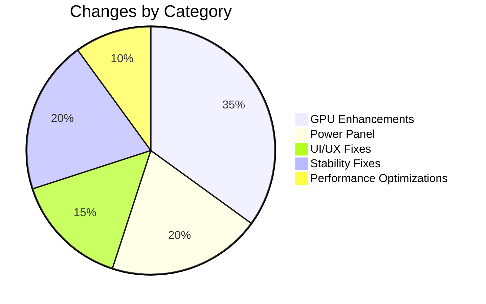

---

## Table of Contents

1. [GPU Monitoring Enhancements](#1-gpu-monitoring-enhancements)
2. [Power Panel Implementation](#2-power-panel-implementation)
3. [UI/UX Improvements](#3-uiux-improvements)
4. [Stability Improvements](#4-stability-improvements)
5. [Performance Optimizations](#5-performance-optimizations)
6. [Platform-Specific Fixes](#6-platform-specific-fixes)
7. [Architecture Overview](#7-architecture-overview)
8. [Files Modified Summary](#8-files-modified-summary)

---

## 1. GPU Monitoring Enhancements

### 1.1 Apple Silicon GPU Support (No Sudo Required)

**Commit**: `2961c7a` - *Add support for GPU stats on Apple Silicon*

Implemented comprehensive GPU monitoring for Apple Silicon Macs (M1/M2/M3/M4) without requiring sudo privileges, using the same approach as the `macmon` tool.

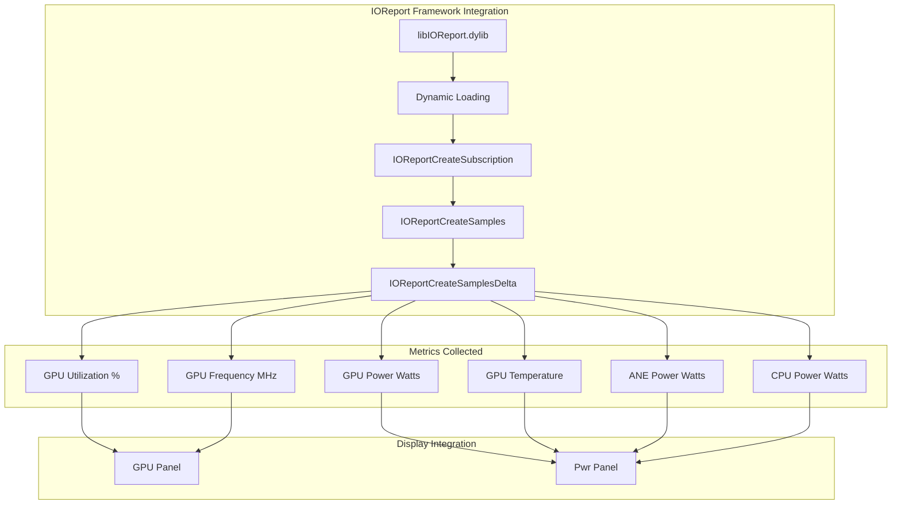

#### Key Components

| Component | File | Description |
|-----------|------|-------------|
| `AppleSiliconGpu` class | `src/osx/apple_silicon_gpu.cpp` | Main GPU collector using IOReport |
| `AppleSiliconGpuMetrics` struct | `src/osx/apple_silicon_gpu.hpp` | Metrics container |
| IOReport function pointers | `src/osx/apple_silicon_gpu.hpp` | Dynamic library loading |

#### Metrics Structure

```cpp
struct AppleSiliconGpuMetrics {
    double gpu_usage_percent = 0.0;      // GPU utilization 0-100
    double gpu_freq_mhz = 0.0;           // Current GPU frequency in MHz
    double gpu_freq_max_mhz = 0.0;       // Maximum GPU frequency in MHz
    double gpu_power_watts = 0.0;        // GPU power consumption in watts
    double gpu_temp_celsius = 0.0;       // GPU temperature in Celsius
    double ane_power_watts = 0.0;        // ANE power consumption in watts
    double ane_activity_cmds = 0.0;      // ANE activity in commands/second
    double cpu_power_watts = 0.0;        // CPU power consumption in watts
};
```

### 1.2 Per-Process GPU Monitoring

**Commit**: `c0ed287` - *Comprehensive GPU process monitoring and fan RPM display*

Added GPU utilization tracking per-process in the process view.

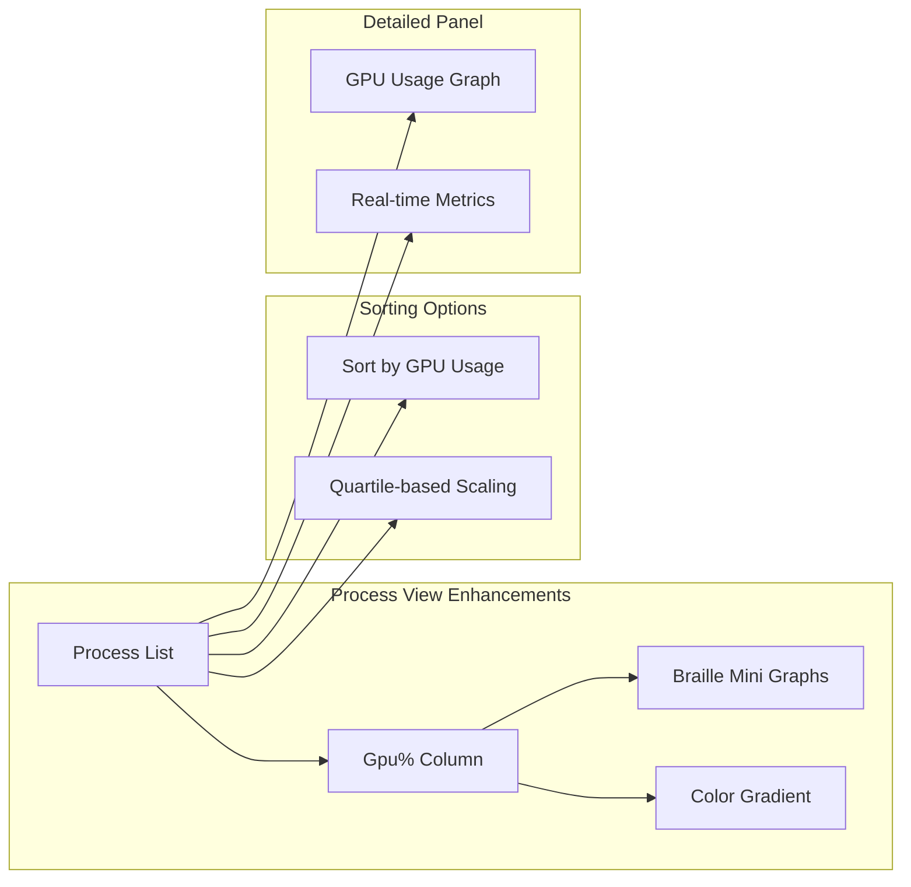

#### Features

- **Gpu% Column**: Shows per-process GPU utilization percentage
- **Braille Mini Graphs**: Visual representation in process list
- **GPU-based Sorting**: Sort processes by GPU usage
- **Quartile Scaling**: Better visualization of GPU usage distribution
- **Color Gradient**: GPU utilization reflected in color intensity

### 1.3 GPU/ANE Panel Layout Improvements

**Commit**: `0805137` - *Improve GPU/ANE panel layout with conditional PWR display*

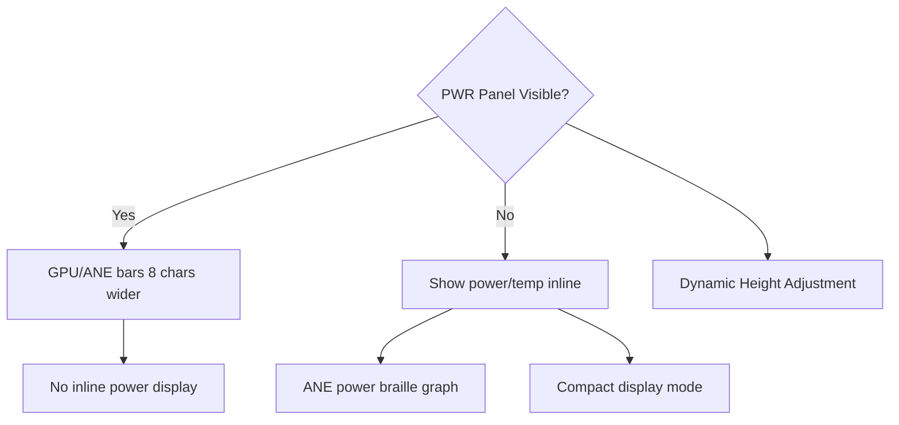

---

## 2. Power Panel Implementation

### 2.1 Comprehensive Power Monitoring

**Commit**: `7543bf3` - *Add comprehensive power monitoring panel for Apple Silicon*

Created a new dedicated Power (Pwr) panel for Apple Silicon Macs.

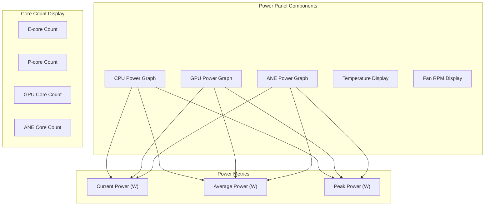

### 2.2 Power Panel Data Structures

```cpp
namespace Pwr {
    extern string box;
    extern int x, y, width, height, min_width, min_height;
    extern bool shown, redraw;

    // Thread-safe mutex for power history
    extern std::mutex history_mutex;

    // Power history deques for braille graphs (in mW)
    extern deque<long long> cpu_pwr_history;
    extern deque<long long> gpu_pwr_history;
    extern deque<long long> ane_pwr_history;

    // Max observed power for auto-scaling (in mW)
    extern long long cpu_pwr_max, gpu_pwr_max, ane_pwr_max;

    // Thread-safe accessors
    deque<long long> get_cpu_history();
    deque<long long> get_gpu_history();
    deque<long long> get_ane_history();
    void update_history(long long cpu_mw, long long gpu_mw,
                        long long ane_mw, size_t max_size = 100);
}
```

### 2.3 Shared Power Variables

```cpp
namespace Shared {
    // E-core/P-core counts
    extern long eCoreCount, pCoreCount;

    // GPU and ANE core counts
    extern long gpuCoreCount, aneCoreCount;

    // Atomic power metrics for thread safety
    extern atomic<double> cpuPower, gpuPower, anePower;       // Current
    extern atomic<double> cpuPowerAvg, gpuPowerAvg, anePowerAvg;  // Average
    extern atomic<double> cpuPowerPeak, gpuPowerPeak, anePowerPeak; // Peak

    // ANE activity (commands/second)
    extern atomic<double> aneActivity;

    // Temperatures
    extern atomic<long long> cpuTemp, gpuTemp;

    // Fan metrics
    extern atomic<long long> fanRpm;
    extern atomic<int> fanCount;
}
```

### 2.4 Fan RPM Support

**Commit**: `c0ed287` - Added fan RPM display in power panel

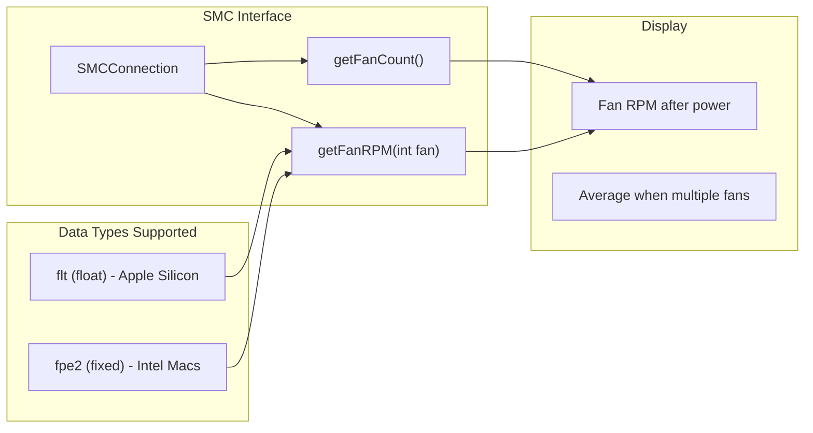

#### SMC Methods Added

```cpp
class SMCConnection {
public:
    SMCConnection();
    ~SMCConnection();

    long long getTemp(int core);  // Existing
    int getFanCount();            // NEW: Returns number of fans
    int getFanRPM(int fan);       // NEW: Returns RPM for specified fan

private:
    kern_return_t SMCReadKey(const UInt32Char_t key, SMCVal_t* val);
    kern_return_t SMCCall(int index, SMCKeyData_t* input, SMCKeyData_t* output);
};
```

### 2.5 Split GPU/ANE Graph View

Toggle key `6` enables split view showing GPU and ANE activity separately:

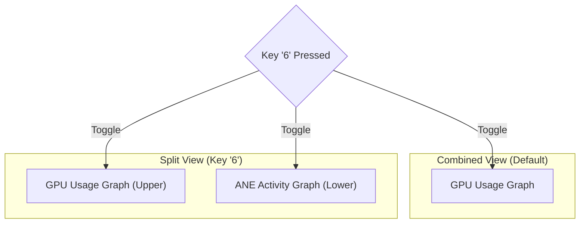

---

## 3. UI/UX Improvements

### 3.1 Disk Panel Enhancements

**Commit**: `5c9ec46` - *Improve disk panel space utilization and navigation*

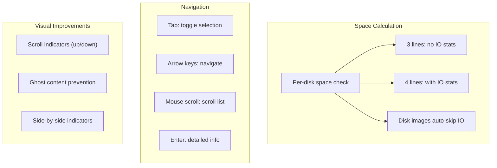

#### Disk Panel Features

| Feature | Description |
|---------|-------------|
| Smart space calculation | Each disk checked for actual space requirement |
| Disk image detection | DMG/ISO/IMG files skip IO stats automatically |
| Ghost content prevention | Clear unused rows after rendering |
| Scroll indicators | Positioned side by side on bottom border |

#### Navigation Enhancements

| Key | Action |
|-----|--------|
| `Tab` | Toggle disk selection mode |
| `Up/Down` | Navigate between disks |
| `Mouse Scroll` | Scroll through disk list |
| `Enter` | Show detailed disk info |

### 3.2 Memory Panel Improvements

- Consistent scroll indicators with disk panel
- Similar navigation behavior across panels
- Improved border rendering

### 3.3 Process Panel GPU Column

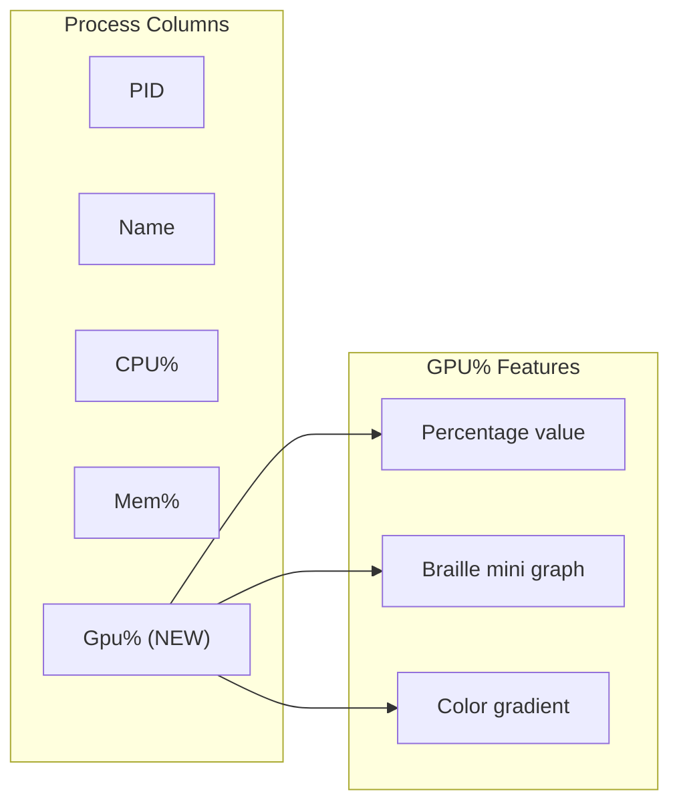

---

## 4. Stability Improvements

### 4.1 Safe Utility Functions

**Commit**: `3b538cc` - *Comprehensive stability improvements with safe utilities*

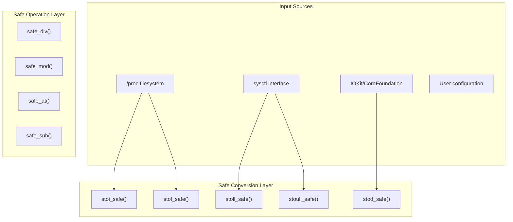

#### Safe Conversion Functions

```cpp
// Safe string to integer conversions using std::from_chars
inline int stoi_safe(const std::string_view str, int fallback = 0) noexcept;
inline long stol_safe(const std::string_view str, long fallback = 0) noexcept;
inline long long stoll_safe(const std::string_view str, long long fallback = 0) noexcept;
inline unsigned long long stoull_safe(const std::string_view str,
                                       unsigned long long fallback = 0) noexcept;
inline double stod_safe(const std::string_view str, double fallback = 0.0) noexcept;
```

#### Safe Arithmetic Operations

```cpp
// Safe division - returns fallback on division by zero
template<typename T>
constexpr T safe_div(T numerator, T denominator, T fallback = T{}) noexcept;

// Safe modulo - returns fallback on division by zero
template<typename T>
constexpr T safe_mod(T numerator, T denominator, T fallback = T{}) noexcept;

// Safe vector access with bounds checking
template<typename T>
const T& safe_at(const vector<T>& vec, size_t index, const T& fallback) noexcept;

// Safe subtraction for unsigned types - prevents underflow
template<typename T>
constexpr T safe_sub(T a, T b) noexcept;
```

### 4.2 Thread Safety Improvements

**Commits**: `c53e033`, `38b7aa5` - *Thread safety and deadlock prevention*

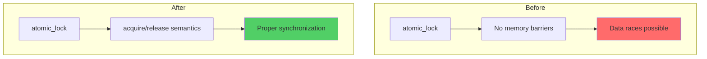

#### Memory Ordering Fixes

```cpp
// Before: potential data race
while (not this->atom.compare_exchange_weak(this->not_true, true)) {
    this->not_true = false;
}

// After: proper memory ordering
while (not this->atom.compare_exchange_weak(this->not_true, true,
        std::memory_order_acquire, std::memory_order_relaxed)) {
    this->not_true = false;
    busy_wait();
}
```

#### Runner Thread Deadlock Prevention

**Commit**: `38b7aa5` - Fixed potential deadlock in runner thread restart mechanism

```cpp
namespace Runner {
    extern atomic<bool> should_terminate;  // Cooperative termination flag
    extern pthread_mutex_t mtx;            // Thread health monitoring mutex
    void thread_trigger();                 // Signal semaphore to wake runner
}
```

### 4.3 Signal Handler Safety

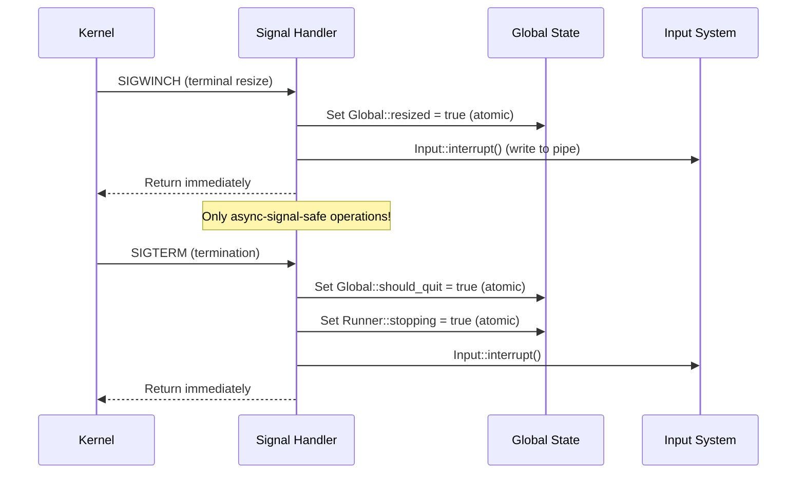

### 4.4 Resource Leak Fixes

**Commit**: `79d862d` - *Address multiple resource leaks and improve error handling*

| Resource | Issue | Fix |
|----------|-------|-----|
| IOHIDEventSystemClientRef | Not released on error paths | RAII wrapper / CFRelease on all paths |
| IORegistryEntry | Not released on all paths | Ensure IOObjectRelease on all exits |
| CoreFoundation objects | Early returns skip CFRelease | Scope guards for cleanup |

### 4.5 Error Handling Improvements

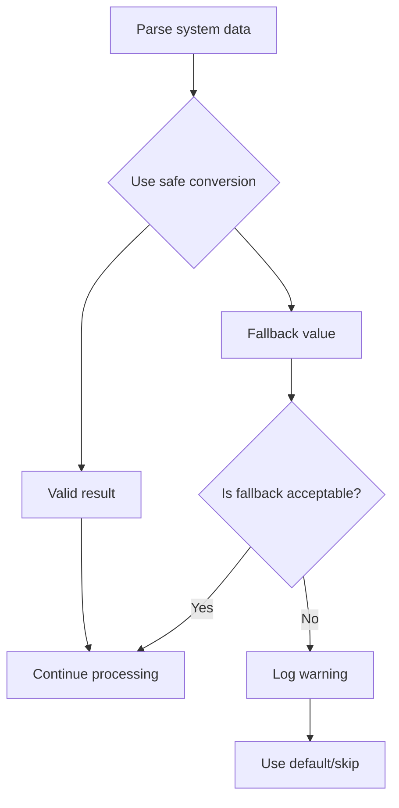

---

## 5. Performance Optimizations

### 5.1 O(n) Lookup Optimization

**Commit**: `2403ed3` - *Comprehensive stability improvements for long-running sessions*

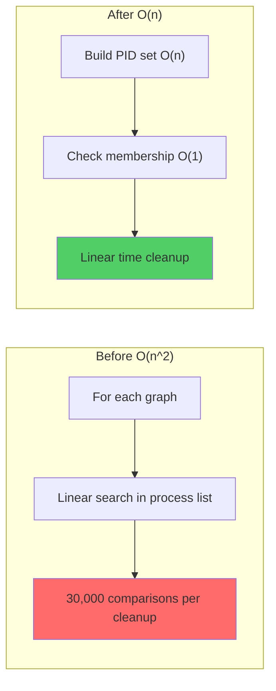

#### Graph Cleanup Optimization

```cpp
// Before: O(n*m) complexity
std::erase_if(p_graphs, [&](const auto& pair) {
    return rng::find(plist, pair.first, &proc_info::pid) == plist.end();
});

// After: O(n+m) complexity using unordered_set
std::unordered_set<pid_t> live_pids;
for (const auto& p : plist) live_pids.insert(p.pid);
std::erase_if(p_graphs, [&](const auto& pair) {
    return not live_pids.contains(pair.first);
});
```

### 5.2 BSD Collector Optimization

Changed `vector<size_t> found` to `unordered_set<size_t>` in BSD collectors for O(1) lookup:

| Collector | File | Optimization |
|-----------|------|--------------|
| FreeBSD | `src/freebsd/btop_collect.cpp` | `unordered_set` for PID lookup |
| NetBSD | `src/netbsd/btop_collect.cpp` | `unordered_set` for PID lookup |
| OpenBSD | `src/openbsd/btop_collect.cpp` | `unordered_set` for PID lookup |

---

## 6. Platform-Specific Fixes

### 6.1 FreeBSD Fixes

- **strtok NULL checks**: Added null pointer checks before using strtok results
- **Safe parsing**: Converted all stoi/stol calls to safe variants

### 6.2 NetBSD/OpenBSD Fixes

- **malloc NULL checks**: Verify malloc return values
- **Division guards**: Prevent division by zero in battery percentage calculations
- **sysctl error handling**: Complete error handling for sysctl calls

### 6.3 macOS Fixes

- **SMC Apple Silicon support**: Handle 'flt ' data type for fan speed on Apple Silicon
- **Intel compatibility**: Maintain backward compatibility with fpe2 format
- **P-state parsing**: Safe parsing with validation

### 6.4 Linux Fixes

- **CPU core map parsing**: Standardized parsing with safe conversions
- **Intel GPU Top**: Fixed resource leaks in GPU monitoring

---

## 7. Architecture Overview

### 7.1 High-Level Architecture

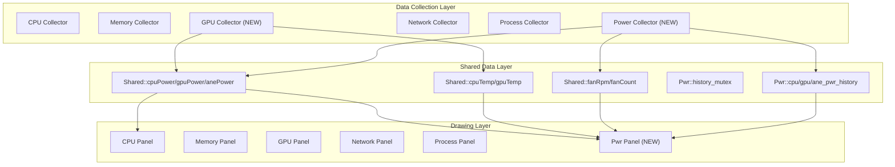

### 7.2 Apple Silicon GPU Data Flow

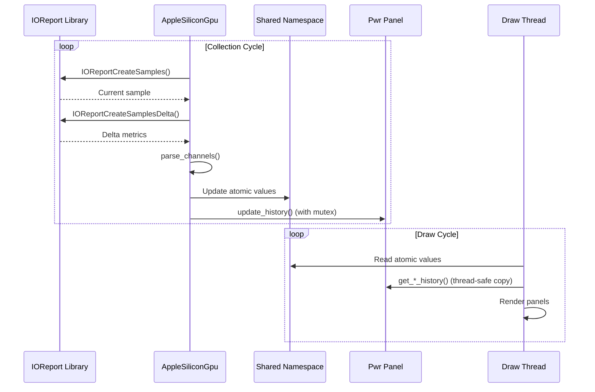

### 7.3 Thread Safety Model

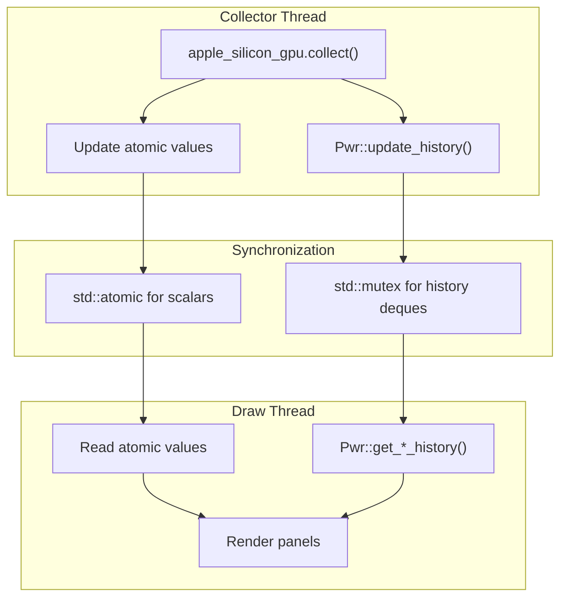

---

## 8. Files Modified Summary

### 8.1 New Files Added

| File | Purpose |
|------|---------|
| `src/osx/apple_silicon_gpu.cpp` | Apple Silicon GPU collector implementation |
| `src/osx/apple_silicon_gpu.hpp` | GPU metrics and class declarations |
| `docs/safe-utilities.md` | Safe utilities documentation |
| `docs/stability-improvements.md` | Stability improvements documentation |
| `tests/ane_*.swift` | ANE test utilities |
| `.gitlab-ci.yml` | GitLab CI/CD pipeline |
| `CLAUDE.md` | Development guide |

### 8.2 Modified Files by Category

#### Core Files

| File | Changes |
|------|---------|
| `src/btop.cpp` | Signal handling, thread management, Apple GPU integration |
| `src/btop_config.cpp` | Disk selection config, safe conversions |
| `src/btop_config.hpp` | New config options |
| `src/btop_draw.cpp` | Pwr panel, GPU%, disk/mem panel improvements |
| `src/btop_input.cpp` | Disk navigation, keyboard handlers |
| `src/btop_menu.cpp` | Disk info menu |
| `src/btop_shared.cpp` | Shared GPU percent maps, power metrics |
| `src/btop_shared.hpp` | Pwr namespace, atomic variables, core counts |
| `src/btop_tools.cpp` | Safe conversions, UTF-8 handling |
| `src/btop_tools.hpp` | Safe utility functions |
| `src/btop_theme.cpp` | Safe RGB parsing |

#### macOS-Specific

| File | Changes |
|------|---------|
| `src/osx/btop_collect.cpp` | GPU integration, disk image detection, fan RPM |
| `src/osx/smc.cpp` | Fan count/RPM methods, Apple Silicon float support |
| `src/osx/smc.hpp` | SMCConnection class updates |
| `src/osx/sensors.cpp` | Temperature collection updates |

#### Platform Stubs

| File | Changes |
|------|---------|
| `src/freebsd/btop_collect.cpp` | Pwr stubs, safe conversions, strtok fixes |
| `src/netbsd/btop_collect.cpp` | Pwr stubs, safe conversions, malloc checks |
| `src/openbsd/btop_collect.cpp` | Pwr stubs, safe conversions, division guards |
| `src/linux/btop_collect.cpp` | Pwr stubs, safe conversions |

### 8.3 Lines of Code Summary

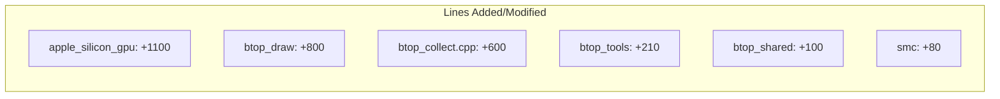

| Category | Lines Added | Lines Modified |
|----------|-------------|----------------|
| GPU Support | ~1100 | ~200 |
| Power Panel | ~400 | ~300 |
| UI Improvements | ~800 | ~400 |
| Safe Utilities | ~210 | ~100 |
| Platform Fixes | ~150 | ~300 |
| **Total** | **~2660** | **~1300** |

---

## Commit History

| Commit | Type | Description |
|--------|------|-------------|
| `c0ed287` | feat | GPU process monitoring and fan RPM display |
| `3fd4bcf` | fix | Critical stability improvements across all platforms |
| `3b538cc` | feat | Comprehensive stability improvements with safe utilities |
| `c53e033` | fix | Thread safety, performance, and best practices |
| `2403ed3` | fix | Stability improvements for long-running sessions |
| `79d862d` | fix | Resource leaks and error handling |
| `38b7aa5` | fix | Deadlock prevention in runner thread |
| `0805137` | feat | GPU/ANE panel layout with conditional PWR display |
| `5c9ec46` | feat | Disk panel space utilization and navigation |
| `7543bf3` | feat | Comprehensive power monitoring panel |
| `2961c7a` | feat | Apple Silicon GPU support (no sudo) |

---

## Testing Recommendations

### Functional Testing

- [ ] GPU metrics accuracy on M1/M2/M3/M4 chips
- [ ] Power panel graph rendering
- [ ] Fan RPM display accuracy
- [ ] Disk panel navigation with mouse/keyboard
- [ ] Process list GPU% column

### Stability Testing

- [ ] Long-running sessions (24+ hours)
- [ ] High process count scenarios (5000+ processes)
- [ ] Rapid terminal resize events
- [ ] Memory pressure testing

### Platform Testing

- [ ] macOS Apple Silicon (M1/M2/M3/M4)
- [ ] macOS Intel (backward compatibility)
- [ ] Linux x86_64
- [ ] FreeBSD
- [ ] NetBSD
- [ ] OpenBSD

---

*Report generated: January 2026*
*Branch: `gpu-apple-silicon-nosudo`*
*Based on commits: `2961c7a` to `c0ed287`*
