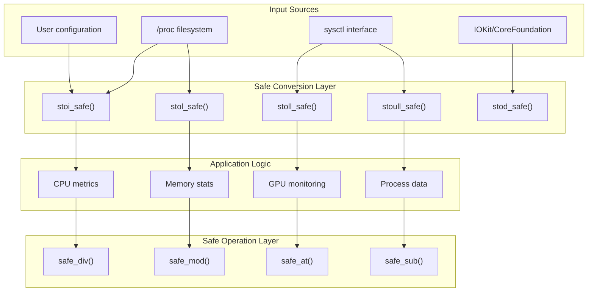
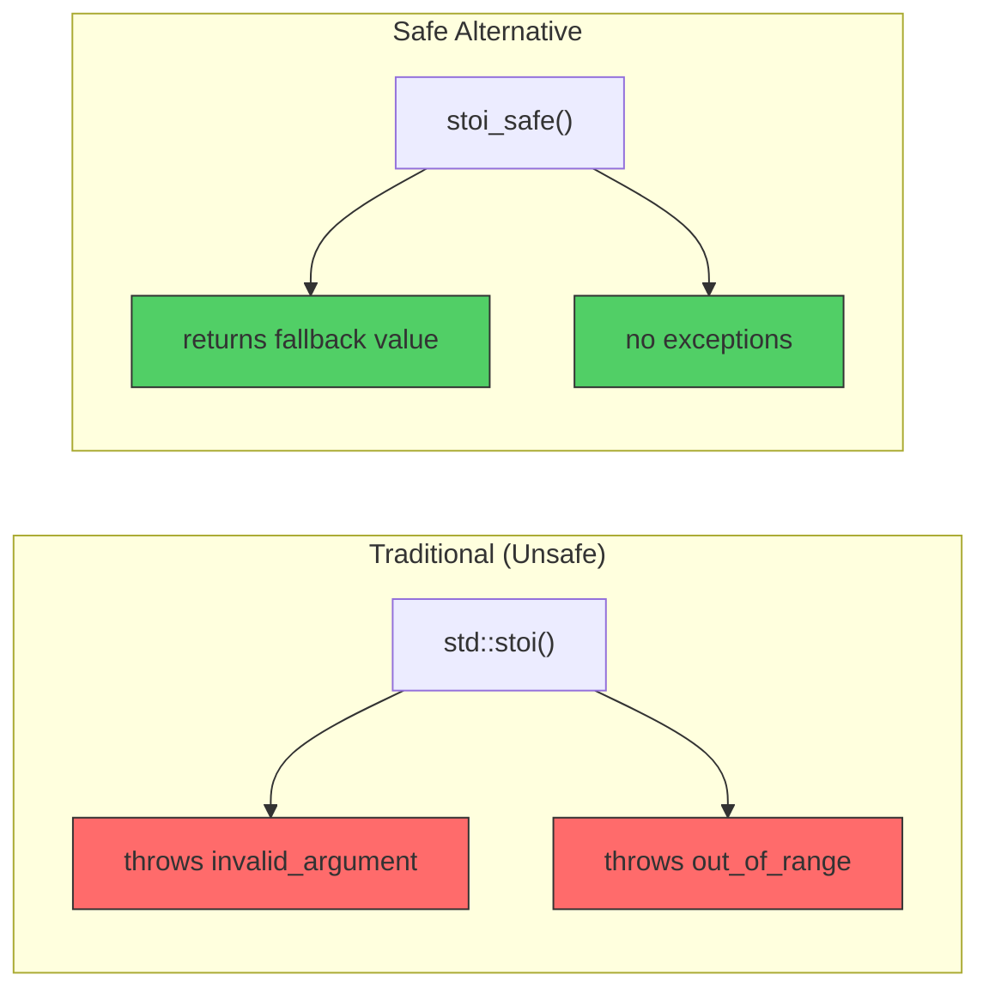
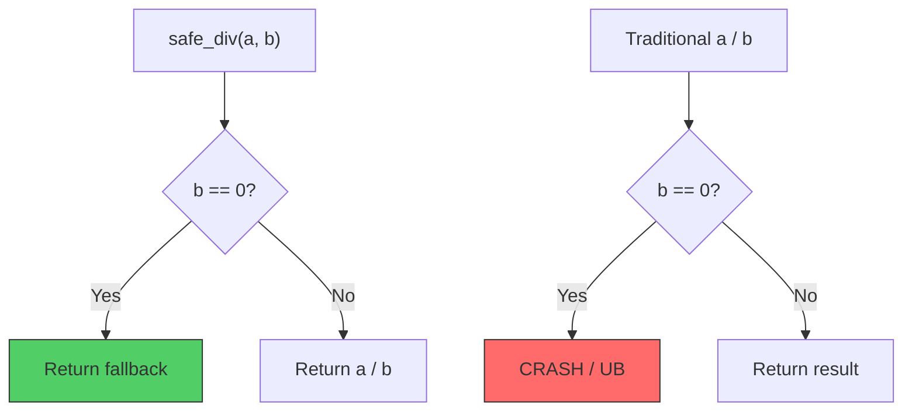
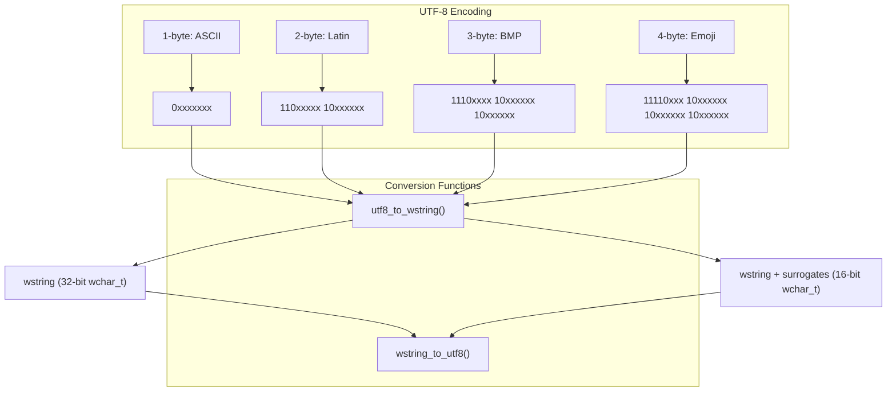
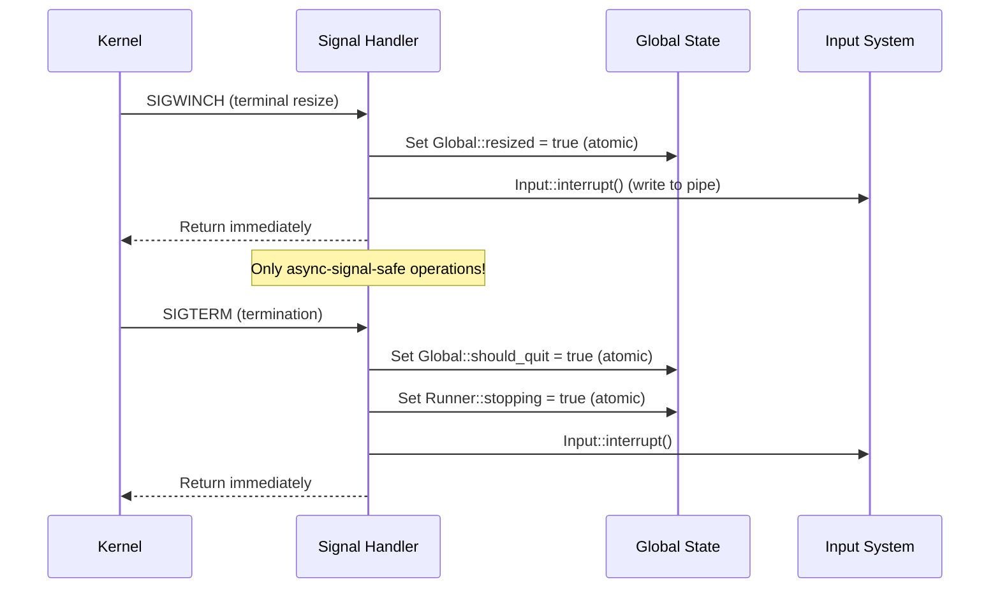
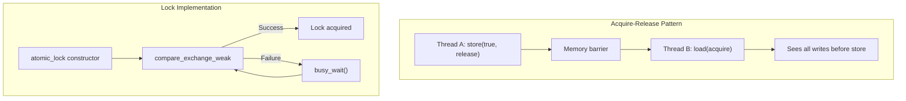
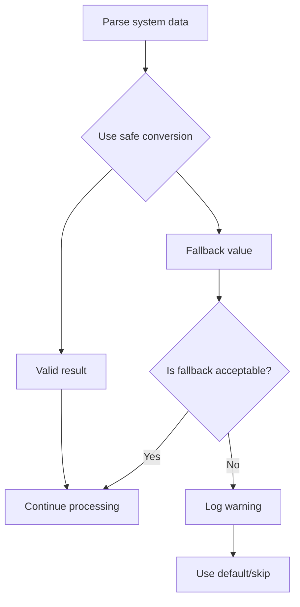

# Safe Utilities Reference

This document describes the safe utility functions added to btop++ for robust error handling and cross-platform compatibility.

## Overview

The safe utilities provide exception-free alternatives to standard library functions that may throw exceptions or cause undefined behavior. These utilities are essential for:

- System monitoring tools that must never crash
- Parsing untrusted data from `/proc` filesystem, `sysctl`, and other system interfaces
- Long-running applications that need to gracefully handle malformed input

## Architecture



## Safe Numeric Conversions

### Function Comparison



### stoi_safe

Safe string to `int` conversion using `std::from_chars`.

```cpp
inline int stoi_safe(const std::string_view str, int fallback = 0) noexcept;
```

**Parameters:**
- `str`: String view to parse
- `fallback`: Value to return on failure (default: 0)

**Returns:** Parsed integer or fallback value

**Example:**
```cpp
int cpu_id = stoi_safe(cpu_name.substr(3));  // "cpu3" -> 3
int invalid = stoi_safe("not_a_number", -1); // returns -1
```

### stol_safe

Safe string to `long` conversion.

```cpp
inline long stol_safe(const std::string_view str, long fallback = 0) noexcept;
```

### stoll_safe

Safe string to `long long` conversion.

```cpp
inline long long stoll_safe(const std::string_view str, long long fallback = 0) noexcept;
```

**Example:**
```cpp
long long mem_bytes = stoll_safe(proc_mem_info["MemTotal"]);
```

### stoull_safe

Safe string to `unsigned long long` conversion.

```cpp
inline unsigned long long stoull_safe(const std::string_view str,
                                       unsigned long long fallback = 0) noexcept;
```

**Example:**
```cpp
uint64_t bytes = stoull_safe(disk_stats["sectors_read"]) * 512;
```

### stod_safe

Safe string to `double` conversion.

```cpp
inline double stod_safe(const std::string_view str, double fallback = 0.0) noexcept;
```

**Note:** Uses `std::stod` internally with exception catching, as `std::from_chars` for floating-point may not be available on all platforms.

**Example:**
```cpp
double frequency = stod_safe(freq_str, 0.0);  // Parse GPU frequency
```

## Safe Arithmetic Operations

### Division Safety Flow



### safe_div

Safe division that returns fallback on division by zero.

```cpp
template<typename T>
constexpr T safe_div(T numerator, T denominator, T fallback = T{}) noexcept;
```

**Example:**
```cpp
int percentage = safe_div(used * 100, total);  // No crash if total is 0
```

### safe_mod

Safe modulo that returns fallback on division by zero.

```cpp
template<typename T>
constexpr T safe_mod(T numerator, T denominator, T fallback = T{}) noexcept;
```

### safe_at

Safe vector access with bounds checking.

```cpp
template<typename T>
const T& safe_at(const vector<T>& vec, size_t index, const T& fallback) noexcept;
```

**Example:**
```cpp
static const string empty_string;
const string& value = safe_at(cpu_values, idx, empty_string);
```

### safe_sub

Safe subtraction for unsigned types that prevents underflow.

```cpp
template<typename T>
constexpr T safe_sub(T a, T b) noexcept;
```

**Example:**
```cpp
uint64_t difference = safe_sub(current_bytes, previous_bytes);  // Never underflows
```

## UTF-8 String Handling

### UTF-8 Conversion Flow



### utf8_to_wstring

Modern UTF-8 to wstring conversion that replaces the deprecated `std::wstring_convert`.

```cpp
std::wstring utf8_to_wstring(const std::string_view str) noexcept;
```

**Features:**
- Handles all valid UTF-8 sequences (1-4 bytes)
- Platform-aware: handles both 32-bit (Linux/macOS) and 16-bit (Windows) wchar_t
- Properly encodes surrogate pairs for 16-bit wchar_t
- Silently skips invalid UTF-8 bytes
- Exception-free (noexcept)

### wstring_to_utf8

Modern wstring to UTF-8 conversion.

```cpp
std::string wstring_to_utf8(const std::wstring_view w_str) noexcept;
```

**Features:**
- Handles both 32-bit and 16-bit wchar_t
- Properly decodes surrogate pairs on 16-bit platforms
- Produces valid UTF-8 output
- Exception-free (noexcept)

## Signal Handler Safety

### Async-Signal-Safe Patterns



### Safe Signal Handling Rules

1. **Atomic Flags Only**: Use `std::atomic<bool>` for flags modified in signal handlers
2. **No Memory Allocation**: Never call `new`, `malloc`, or container operations
3. **No Standard I/O**: Don't use `cout`, `printf`, or file streams
4. **Minimal Operations**: Set flags and return immediately
5. **Use write() for Pipes**: The only safe I/O is `write()` to a file descriptor

## Memory Ordering

### Atomic Operation Ordering



## Best Practices

### When to Use Safe Utilities

| Scenario | Recommended Function |
|----------|---------------------|
| Parsing /proc files | `stol_safe()`, `stoull_safe()` |
| User input validation | `stoi_safe()`, `stod_safe()` |
| Percentage calculations | `safe_div()` |
| Array access from parsed indices | `safe_at()` |
| Network/disk byte counters | `safe_sub()` |
| Display width calculations | `utf8_to_wstring()` |

### Error Handling Strategy



## Performance Considerations

- `std::from_chars` is faster than `std::stoi` as it doesn't construct locale data
- Safe utilities add minimal overhead (single comparison for most operations)
- UTF-8 conversion reserves memory upfront to minimize allocations
- Templates are fully inlined by the compiler

## Compatibility

| Compiler | Minimum Version | Notes |
|----------|----------------|-------|
| GCC | 8.0+ | Full `from_chars` support |
| Clang | 7.0+ | Full `from_chars` support |
| MSVC | 19.14+ | Full `from_chars` support |
| Apple Clang | 10.0+ | Full `from_chars` support |

## Related Files

- [src/btop_tools.hpp](../src/btop_tools.hpp) - Safe utility declarations
- [src/btop_tools.cpp](../src/btop_tools.cpp) - UTF-8 conversion implementations
- [src/btop.cpp](../src/btop.cpp) - Signal handler implementations
