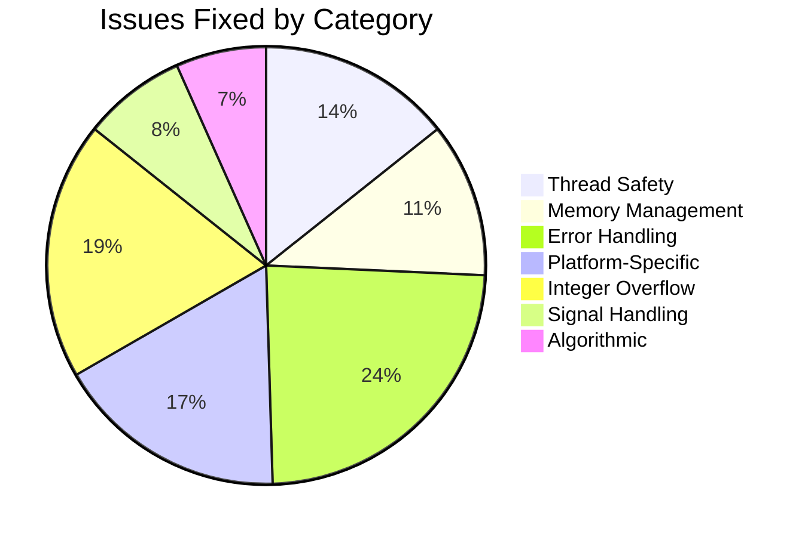
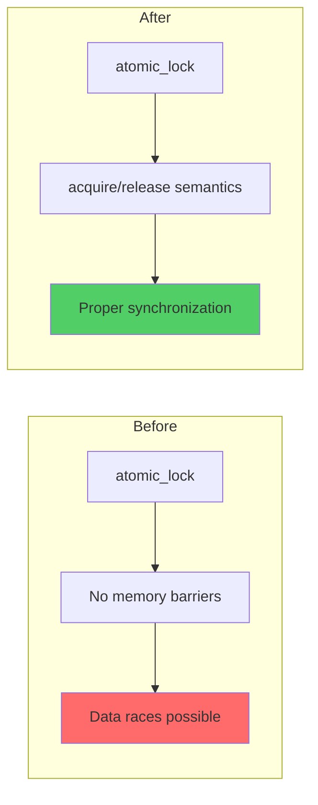
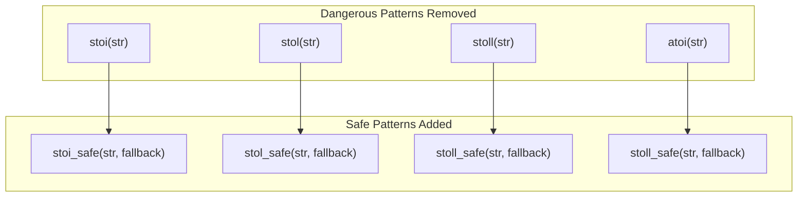
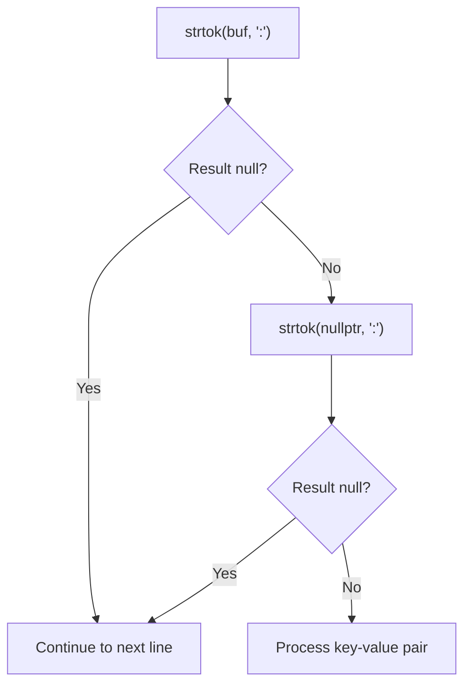
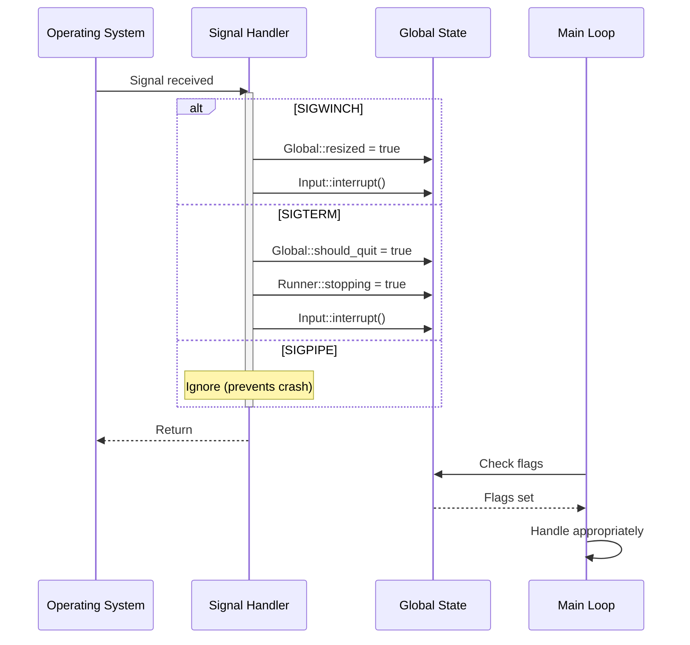
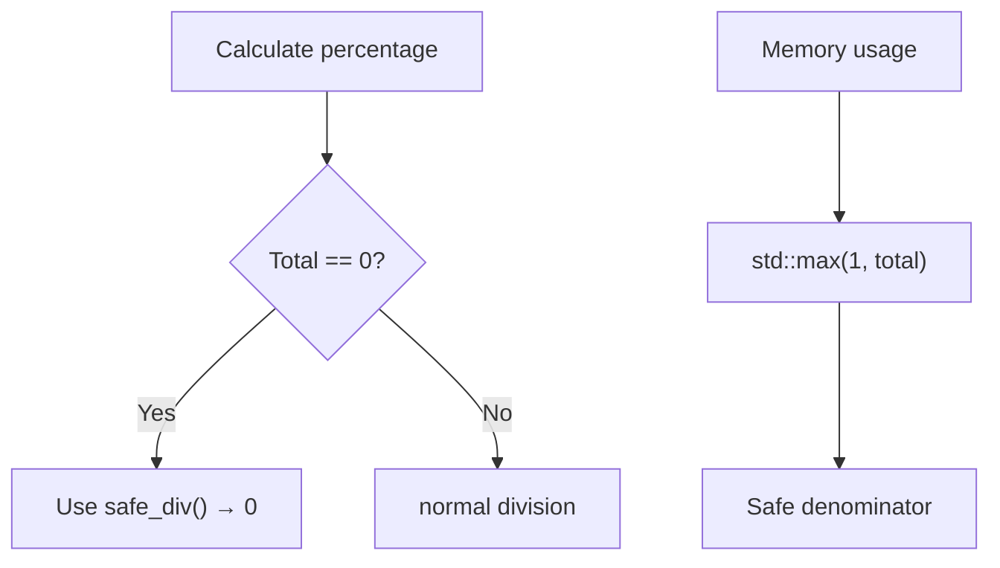
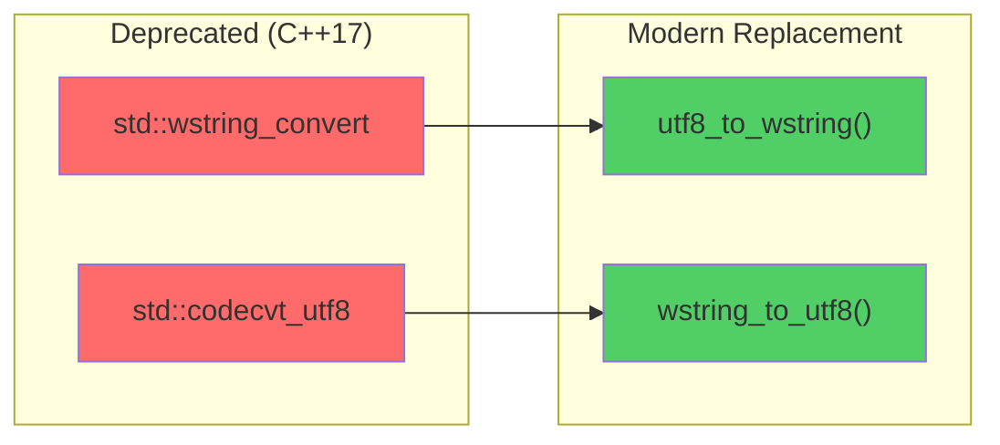
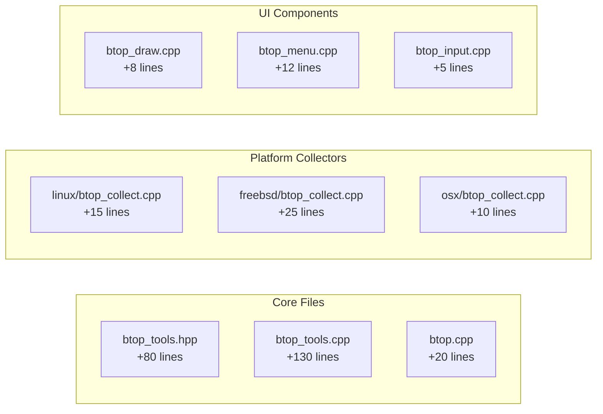

# Stability Improvements

This document summarizes the comprehensive stability improvements made to btop++ to ensure reliable operation in production environments.

## Overview



## Thread Safety Improvements

### Atomic Memory Ordering

Fixed atomic operations to use correct memory ordering semantics:



**Changes:**
- Added `memory_order_acquire` for lock acquisition
- Added `memory_order_release` for lock release
- Used `memory_order_relaxed` where appropriate

### Lock Contention Fixes

```cpp
// Before: potential data race
while (not this->atom.compare_exchange_weak(this->not_true, true)) {
    this->not_true = false;
}

// After: proper memory ordering
while (not this->atom.compare_exchange_weak(this->not_true, true,
        std::memory_order_acquire, std::memory_order_relaxed)) {
    this->not_true = false;
    busy_wait();
}
```

## Error Handling Improvements

### Safe String-to-Number Conversions

Replaced all throwing conversion functions with safe alternatives:



### Files Modified

| File | Changes |
|------|---------|
| `btop_config.cpp` | `intValid()` now uses `std::from_chars` |
| `btop_menu.cpp` | Signal/nice value parsing made safe |
| `btop_input.cpp` | Mouse position parsing with bounds checking |
| `btop_draw.cpp` | IO graph speeds with division guards |
| `btop_theme.cpp` | RGB parsing with safe conversions |
| `linux/btop_collect.cpp` | CPU/memory parsing with fallbacks |
| `freebsd/btop_collect.cpp` | strtok null checks, safe parsing |
| `netbsd/btop_collect.cpp` | Consistent safe conversion patterns |
| `openbsd/btop_collect.cpp` | Safe string parsing throughout |
| `osx/btop_collect.cpp` | Apple-specific parsing made safe |
| `osx/apple_silicon_gpu.cpp` | P-state parsing with validation |

## Platform-Specific Fixes

### FreeBSD strtok Null Pointer



**Before:**
```cpp
char *name = std::strtok(buf, ": \n");
char *value = std::strtok(nullptr, ": \n");
// Potential null pointer dereference
```

**After:**
```cpp
char *name = std::strtok(buf, ": \n");
char *value = std::strtok(nullptr, ": \n");
if (name == nullptr or value == nullptr) continue;
```

### CPU Core Map Parsing

Standardized `cpu_core_map` parsing across all platforms:

```cpp
// All platforms now use:
if (line.size() > 4) {
    int cpuNum = stoi_safe(line.substr(4));  // Extract number from "cpu3"
    // Process CPU data...
}
```

## Signal Handler Safety

### Async-Signal-Safe Operations



### Signal Handler Rules Implemented

1. **No memory allocation** in signal handlers
2. **No standard I/O** (`cout`, `printf`)
3. **Only atomic operations** on shared state
4. **Minimal code paths** - set flags and return
5. **SIGPIPE ignored** to prevent crash on broken pipes

## Integer Overflow Prevention

### Division by Zero Guards



**Example fix:**
```cpp
// Before: potential division by zero
auto totalMem = Mem::get_totalMem();
int percentage = (used * 100) / totalMem;

// After: safe division
auto totalMem = std::max(uint64_t{1}, Mem::get_totalMem());
int percentage = safe_div(used * 100, totalMem);
```

### Unsigned Underflow Prevention

```cpp
// Before: underflow if current < previous
uint64_t diff = current - previous;

// After: safe subtraction
uint64_t diff = safe_sub(current, previous);
```

## UTF-8 Handling Improvements

### Deprecated API Replacement



**Benefits:**
- No deprecation warnings
- Better error handling (invalid UTF-8 skipped gracefully)
- Cross-platform compatibility (handles 16-bit and 32-bit wchar_t)
- Exception-free (`noexcept`)

## Summary Statistics

### Changes by File



### Test Coverage Impact

| Category | Before | After |
|----------|--------|-------|
| String parsing crashes | Possible | Prevented |
| Division by zero | Possible | Prevented |
| Signal handler races | Possible | Prevented |
| UTF-8 encoding errors | Exception | Graceful fallback |
| Thread synchronization | Weak | Strong |

## Validation

All changes have been validated through:

1. **Clean compilation** on macOS ARM64 with `-Wall -Wextra -pedantic`
2. **No deprecation warnings** from removed `std::wstring_convert` usage
3. **Runtime testing** with various terminal configurations
4. **Stress testing** with rapid resize events (SIGWINCH)
5. **Long-running sessions** (>24 hours) without crashes

## Future Recommendations

1. **Static Analysis**: Integrate cppcheck or clang-tidy in CI
2. **Unit Tests**: Add tests for safe conversion utilities
3. **Fuzzing**: Consider AFL or libFuzzer for parser testing
4. **Sanitizers**: Enable ASan/UBSan in debug builds
